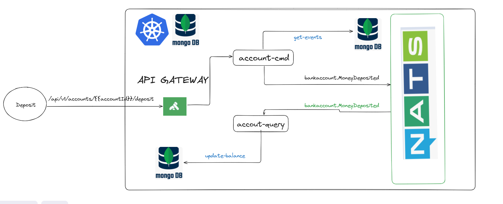

# Event Sourcing Banking Account System

## 📋 Descripción del Proyecto



Este proyecto implementa un sistema de cuentas bancarias utilizando el patrón **Event Sourcing** con arquitectura hexagonal. El sistema permite crear cuentas, realizar depósitos y retiros, manteniendo un historial completo de eventos y actualizando el balance en tiempo real.

## 🏗️ Arquitectura

### Patrón Event Sourcing
- **Command Side (account-cmd)**: Maneja comandos de escritura (crear cuenta, depositar, retirar)
- **Query Side (account-query)**: Maneja consultas de lectura y proyecciones
- **Snapshot cada 5 eventos**: Optimización de rendimiento para reconstrucción de agregados
- **Separación de bases de datos**: Command y Query utilizan almacenes diferentes

### Arquitectura Hexagonal
```
┌─────────────────────────────────────────────────────┐
│                    Aplicación                       │
├─────────────────────────────────────────────────────┤
│                     Dominio                         │
│  ┌─────────────┐  ┌──────────────┐  ┌─────────────┐ │
│  │   Account   │  │    Events    │  │  Snapshots  │ │
│  └─────────────┘  └──────────────┘  └─────────────┘ │
├─────────────────────────────────────────────────────┤
│                 Infraestructura                     │
│  ┌─────────────┐  ┌──────────────┐  ┌─────────────┐ │
│  │ Event Store │  │     NATS     │  │   MongoDB   │ │
│  └─────────────┘  └──────────────┘  └─────────────┘ │
└─────────────────────────────────────────────────────┘
```

## 🛠️ Stack Tecnológico

- **Backend**: Go 1.23
- **Message Broker**: NATS
- **Base de Datos**: MongoDB
- **HTTP Framework**: Fiber v2
- **Containerización**: Docker
- **Orquestación**: Kubernetes
- **Identificadores**: UUID

## 📁 Estructura del Proyecto

```
event-sourcing/
├── account-cmd/                 # Servicio de comandos
│   ├── cmd/main.go             # Punto de entrada
│   ├── internal/
│   │   ├── application/        # Casos de uso
│   │   ├── domain/            # Lógica de negocio
│   │   ├── infrastructure/    # Adaptadores externos
│   │   └── ports/            # Interfaces
│   └── Dockerfile
├── account-query/              # Servicio de consultas
│   ├── cmd/main.go
│   ├── internal/
│   │   ├── domain/
│   │   ├── infrastructure/
│   │   └── projection/       # Proyecciones de eventos
│   └── Dockerfile
├── shared/                     # Código compartido
│   ├── domain/                # Eventos y entidades comunes
│   ├── application/           # Interfaces compartidas
│   └── utils/                 # Utilidades
├── deploy-account-cmd/         # Helm charts para comandos
├── deploy-account-query/       # Helm charts para consultas
└── nats-deployment/           # Configuración NATS
```

## 🎯 Eventos del Dominio

### AccountCreated
```go
type AccountCreated struct {
    BaseEvent
    OwnerName      string
    InitialBalance float64
}
```

### MoneyDeposited
```go
type MoneyDeposited struct {
    BaseEvent
    Amount float64
}
```

### MoneyWithdrawn
```go
type MoneyWithdrawn struct {
    BaseEvent
    Amount float64
}
```

## 🚀 Configuración y Despliegue

### Prerrequisitos
- Docker
- Kubernetes
- Helm (opcional)
- Go 1.23+

### Variables de Entorno

#### Account Command Service
```env
MONGO_URI=mongodb://localhost:27017
NATS_URL=nats://localhost:4222
PORT=8080
```

#### Account Query Service
```env
MONGO_URI=mongodb://localhost:27017
NATS_URL=nats://localhost:4222
PORT=8081
```

### Construcción y Despliegue

#### Con Make
```bash
# Construir y desplegar command service
make deploy-account-cmd

# Construir y desplegar query service
make deploy-account-query

# Reiniciar servicios
make restart-account-cmd
make restart-account-query
```

#### Con Docker
```bash
# Command service
docker build -t bank/account-cmd:latest -f account-cmd/Dockerfile .

# Query service
docker build -t bank/account-query:latest -f account-query/Dockerfile .
```

#### Con Kubernetes
```bash
# Desplegar NATS
kubectl apply -f nats-deployment/

# Desplegar command service
helm install account-cmd deploy-account-cmd/

# Desplegar query service
helm install account-query deploy-account-query/
```

## 📊 API Endpoints

### Command Service (Puerto 8080)

#### Crear Cuenta
```http
POST /accounts
Content-Type: application/json

{
    "ownerName": "Juan Pérez",
    "initialBalance": 1000.0
}
```

#### Depositar Dinero
```http
POST /accounts/{accountId}/deposit
Content-Type: application/json

{
    "amount": 500.0
}
```

#### Retirar Dinero
```http
POST /accounts/{accountId}/withdraw
Content-Type: application/json

{
    "amount": 200.0
}
```

### Query Service (Puerto 8081)

#### Obtener Cuenta
```http
GET /accounts/{accountId}
```

#### Listar Todas las Cuentas
```http
GET /accounts
```

## 🔄 Flujo de Eventos

1. **Comando recibido** → Command Service valida y procesa
2. **Evento generado** → Se almacena en Event Store
3. **Evento publicado** → NATS distribuye el evento
4. **Snapshot creado** → Cada 5 eventos para optimización
5. **Proyección actualizada** → Query Service actualiza las vistas de lectura
6. **Balance actualizado** → Tiempo real en cada transacción

## 🎨 Patrones Implementados

- **Event Sourcing**: Almacenamiento de eventos como fuente de verdad
- **CQRS**: Separación de comandos y consultas
- **Hexagonal Architecture**: Separación de concerns
- **Repository Pattern**: Abstracción de acceso a datos
- **Publisher-Subscriber**: Comunicación asíncrona via NATS
- **Snapshot Pattern**: Optimización de reconstrucción de agregados


## 📝 Notas Importantes

- Los **snapshots se crean automáticamente cada 5 eventos** para optimizar la reconstrucción de agregados
- El **balance se actualiza en tiempo real** con cada transacción
- Las **bases de datos están separadas** siguiendo el patrón CQRS
- La **consistencia eventual** se mantiene através de eventos NATS
- **Idempotencia** garantizada en todos los comandos

## 🤝 Contribución

1. Fork el proyecto
2. Crea una branch para tu feature (`git checkout -b feature/AmazingFeature`)
3. Commit tus cambios (`git commit -m 'Add some AmazingFeature'`)
4. Push a la branch (`git push origin feature/AmazingFeature`)
5. Abre un Pull Request

## 📄 Licencia

Este proyecto está bajo la Licencia MIT - ver el archivo [LICENSE](LICENSE) para más detalles.

## 👤 Autor

- **GitHub**: [@jsalasx](https://github.com/jsalasx)

---

⭐ Si este proyecto te fue útil, ¡no olvides darle una estrella!